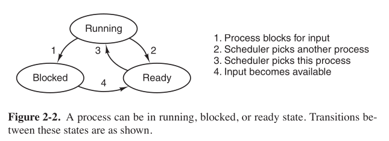
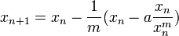
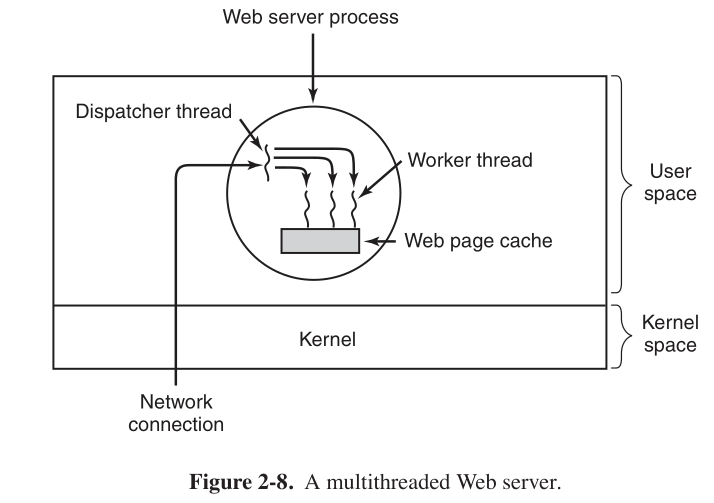
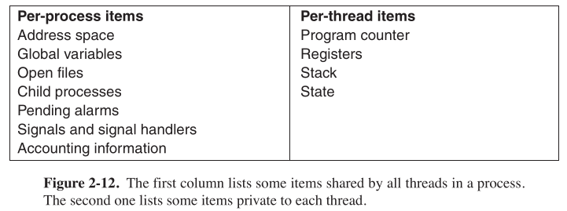
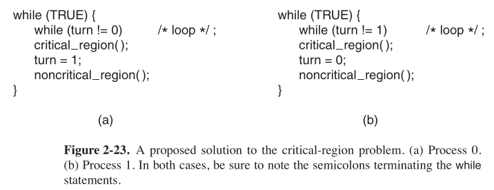
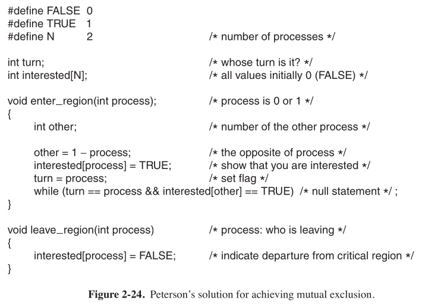

# 《現代操作系統（第四版）》 第二章 章節練習題 

## 1-10

> ​	1.圖2-2給出了三個進程狀態。理論上，三個狀態之間可以有六種轉換，每個狀態兩個。但圖中只給出了四種轉換，其餘兩種轉換是否可能發生？
>
> 

​	圖中没有出現的狀態是從阻塞到運行，**從就緒到阻塞**。從阻塞到運行是**可能**的，比如說等待其餘進程完成I/O操作後，當前進程即從阻塞進入運行狀態。從就緒到阻塞是不可能發生的，進程不可能什麼都不做就進入阻塞狀態。

> ​	2.假設要設計一種先進的計算機體系結構，它使用硬件代替中斷來完成進程切換。進程切換時CPU需要哪些信息？請描述用硬件完成進程切換的工作過程。

​	當進行上下文切換時，從寄存器讀取當前進程表項地址指針，將當前進程狀態存入，然後從中斷向量表找到待啟動進程的表項，讀取其內容啟動進程。

> ​	3.當代計算機中，為什麽中斷處理程序至少有一部分是匯編語言編寫的？

​	因為匯編語言執行速度比高級語言要快，而進行中斷處理對執行速度有很高的要求。其次，因為中斷處理程序需要操作寄存器，設置堆棧指針等，而高級語言**不允許**直接訪問cpu，所以只能使用匯編。

> ​	4.中斷或系統調用把控制權轉交給操作系統時，為什麽通常會用到與被中斷進程的棧分離的內核棧？

​	內核數據保存在用戶空間中可以被進程訪問，不安全。

> ​	5.一個計算機系統的內存有足夠的空間容納5個程序。這些程序有一半的時間處於等待I/O的空閑狀態。請問CPU時間浪費的比例是多少？

​	CPU利用率 = 1 - p^n （n为進程數，p为I/O操作與進程在內存中駐留時間之比）

​	代入計算可得時間浪費比例爲1/32。

> ​	6.一個計算機的RAM有4GB，其中操作系統占512MB。所有進程都占256MB（為了簡化計算）並且特征相同，要使CPU利用率達到99%，最大的I/O等待是多少？

​	該計算機允許最多14個進程同時駐留在內存中，要使CPU利用率達到99%，即p^14 = 0.01,由牛頓法計算得p=0.719686，四舍五入就是72%。



> ​	7.如果多個作業能夠並行運行，會比它們順序執行完成得快。假設有兩個作業同時開始執行，每個需要20分鐘CPU時間。如果順序執行，那麽完成最後一個作業需要多長時間？如果並行執行又需要多長時間？假設I/O等待占50%。

​	需要20分鐘CPU時間，且p=50%，則順序執行兩個作業需要80分鐘;如果並行執行，CPU利用率為75%，那麽並行執行需要時間為40 / 75%，即53分鐘。

*然而爲什麼要用parallel這個詞啊，不應該是並發麼。*

> ​	8.考慮一個6級多道程序系統（內存中可同時容納6個程序）。假設每個進程的I/O等待占40%，那麽CPU利用率是多少？

​	代入公式計算，結果是0.995904，即99%。

> ​	9.假設要從互聯網上下載一個2GB大小的文件，文件內容可從一組鏡像服務器獲得，每個服務器可以傳輸文件的一部分。假設每個傳輸請求給定起始字節和結束字節。如何用多線程優化下載時間？

​	客戶端創建多個線程並對所請求的文件**分塊**，每個線程按次序從**不同**服務器請求文件塊至傳輸完成。若服務端的可用上行帶寬大於客戶端的可用下行帶寬，這其實沒啥用，只有當資源緊促（比如某壹服務器連接不上或速度慢）的時候才有效果。

> ​	10.爲什麼圖2-11a的模型不適用於在內存中使用高速緩存的文件服務器？每個進程可以有自己的高速緩存嗎？
>
> .png)

​	 高速緩存中的數據應該是共享的，每個進程有自己的高速緩存似乎沒有意義：當一個進程對高速緩存作出更改後，若每個進程有自己的高速緩存，在作出更改後需要同步，這是很大的開銷，然而共享緩存沒有這樣的麻煩。第二點是，高速緩存內的數據似乎多數時間裏是用來讀，而不是用來寫的，每一個進程都分配的話會造成資源的浪費，沒有必要這麼做。

## 11-20

> ​	11.當一個多線程進程創建子進程時，如果子進程復制父進程的所有線程，就會出現問題：假如父進程中有一個線程正在等待鍵盤輸入，現在就有兩個線程在等待鍵盤輸入，父進程和子進程各有一個。這種問題在單線程進程中也會發生嗎？

​	不會，等待輸入時線程被阻塞，由於是單線程，所以進程阻塞，不能創建子進程;多線程由於堵塞的時等待輸入的線程，其他線程還可以運行。

> ​	12.圖2-8給出了一個多線程Web服務器。如果讀取文件只能使用阻塞的read系統調用，那麼Web服務器應該使用用戶級線程還是內核級線程？爲什麼？
>
> 

​		應該使用內核級線程，若使用用戶級線程，一個線程進入阻塞會導致整個進程都進入阻塞狀態。

> ​	13.在本章中，我們介紹了多線程Web服務器，說明它比單線程服務器和有限狀態機更好的原因。存在單線程服務器更好的情形嗎？請舉例。

​	相比單線程實現了並行，且性能更好;相比有限狀態機，實現其來比較簡單。存在，請求處理時間短且請求量大的情況便是。因爲對於此類情況單線程不需要進行頻繁的上下文切換，節省了時間。

> ​	14.既然計算機中只有一套寄存器，爲什麼圖2-12中的寄存器集合是按每個線程列出而不是按每個進程列出？
>
> 

​	線程與線程之間的關系類似於進程與進程之間的關系，線程之間進行切換與進程的上下文切換類似，同樣需要保存其值，需要維護線程表。

> ​	15.在沒有時鍾中斷的系統中，一個線程放棄CPU後可能再也不會獲得CPU資源，那麼爲什麼線程還要通過調用thread_yield自願放棄CPU？

​	線程運行時間超過預期，此時需要結束當期線程。對於內核級線程，OS可以選擇運行哪一個線程;對於用戶級線程，只能等待線程的時間片用完。因此只能通過線程主動退出的方式來將其結束。

> 16.線程可以被時鍾中斷搶佔嗎？如果可以，在什麼情形下可以？如果不可以，爲什麼不可以？

​	內核級線程可以;用戶級線程不可以， OS並不知道線程的存在。

> ​	17.In this problem you are to compare reading a file using a single-threaded file server and a multithreaded server.It takes 12 msec to get a request for work,dispatch it,and do the rest of the necessary processing,assuming that the data needed are in the block cache.If a disk operation is needed, as is the case one-third of the time,an additional 75 msec is required, during which time the thread sleeps. How many requests/sec can the server handle if it is single threaded?If it is multithreaded?
>
> 翻譯：在這個問題中請對使用單線程文件服務器和多線程文件服務器讀寫文件進行比較。假設所需數據在高速緩存中，獲得請求，分派工作並完成其餘必要工作需要12ms;在1/3的時間內，需要一個磁盤操作（即所需數據不在cache中），需要額外的75ms來完成，此時該線程進入睡眠。單線程服務器每秒可以處理多少個請求？多線程服務器呢？
>
> *題目沒看懂，原來是漢譯版翻譯錯了，直接貼原版的吧。下面是潤色機翻。*

​	單線程：1000 / (1/3 * (12+75) + 2/3 * 12) = 27.027027027027028

​	多線程： 1000 / 12 = 83.33333333333333

​	注意：多線程的結果並不是準確的。

> ​	18.在用戶態實現線程的最大優點是什麼？最大缺點是什麼？

​	最大優點是用戶級線程可以在不支持線程的操作系統上實現;最大的缺點是難以處理線程阻塞。

> ​	19.圖2-15中，創建線程和打印消息的順序是隨機交錯的。有沒有一種方法可以嚴格按照以下次序運行：創建線程1,線程1打印消息，線程1結束;創建線程2,線程2打印消息，線程2結束;依此類推。如果有，請說明方法;如果沒有，請解釋原因。
>
> 

​	方法是有的，等當前線程結束再創建新線程即可。	

> ​	20.在討論線程中的全局變量時，曾使用過程create_globe將存儲分配給指向變量的指針，而不是變量自身。這是必需的嗎？還是直接使用變量自身也可行？

​	是必需的，因爲全局變量大小不確定。

## 21-30

> ​	21.考慮一個線程全部在用戶態實現的系統，該運行時系統每秒種獲得一個時鍾中斷。當某個線程正在該運行時系統中執行時發生了一個時鍾中斷，此時會出現什麼問題？你有什麼解決該問題的建議嗎？

​	運行時系統可能剛剛阻塞或者取消阻塞線程，也就是說運行時系統與中斷的步調不一致。這時候應該設置標志位：運行時系統結束後檢查標志看是否發生時鍾中斷，然後運行中斷處理程序。

​	*線程在一個運行時系統的上層運行，該運行時系統是一個管理線程的過程的集合*

> ​	22.假設一個操作系統中不存在類似於select的系統調用來提前判斷從文件、管道或設備中讀取數據時是否安全，但該操作系統允許設置定時來中斷阻塞的系統調用。在上述條件下，是否有可能在用戶態實現一個線程包？請討論。
>
> *select允許調用者通知預期的read是否會阻塞*

​	使用select可以實現用戶級線程包的阻塞系統調用，所以這個題目的意思就是，在給出的初始條件下實現阻塞系統調用。這是可以的，但是效率很差。

> ​	23.兩個進程在一個共享內存的多處理器（兩個CPU）上運行，當它們要共享一塊內存時，圖2-23中使用turn變量的忙等待解決方案還有效嗎？
>
> 

​	當然有效。

> 24.在搶佔式進程調度的條件下，圖2-24中互斥問題的Peterson解法可行嗎？如果是非搶佔式調度呢？
>
> 

​	當然適用，該方法正是爲此設計的。如果是非搶佔式，在某些情況下當前進程可能永遠佔用CPU。

> 25. 2.3.4節中所討論的優先級反轉問題在用戶級線程中是否可能發生？爲什麼？

​	不能，因爲對於用戶級線程，只有線程主動退出才行，操作系統不能進行調度。

> 26.2.3.4節描述了一種有高優先級進程H和低優先級進程L的情況，導致了H陷入死循環。若採用輪轉調度法代替優先級調度算法，還會發生同樣問題嗎？請討論。

​		不會，因爲採用輪轉調度法，每一個進程都會得到執行。

> 27.在使用線程的系統中，若使用用戶級線程，是每個線程一個棧還是每一個進程一個棧？如果使用內核級線程呢？請解釋。

​	無論是用戶級線程還是內核級線程，均是「每個線程一個棧」。線程之間的關系與進程之間類似，都需要各自的表項保存運行時的狀態。

> 28.在開發計算機時，通常首先用一個程序模擬執行，一次運行一條指令，多處理器也嚴格按此模擬。在這種沒有同時事件發生的情形下，會出現競爭條件嗎？

​	會出現，如I/O操作相同地址。

> 29.將生產者-消費者問題擴展成一個多生產者-多消費者的問題，生產（消費）者都寫（讀）一個共享的緩衝區，每個生產者和消費者都在自己的線程中執行。圖2-28中使用信號量的解法在這個系統中還可行嗎？

​	可行。	

> 30.考慮對於兩個進程P0和P1的互斥問題的解決方案。假設變量初始值爲0。P0的代碼如下：
>
> ```c
> /* Other code*/
> 
> while(turn != 0){}/*Do nothing and wait*/
> Critical Section/*...*/
> turn = 0;
> /* Other code*/
> ```
>
> ​	P1的代碼是將上述代碼中的0替換爲1.該方法是否能處理互斥問題中所有可能的情形？

​	這是嚴格輪換法，忙等待非常的浪費CPU時間，所以這不是一個好的方法。此方法要求兩個進程嚴格地輪流進入它們的臨界區，所以並不能處理所有情形。

## 31-40 

> 31.一個可以屏蔽中斷的操作系統如何實現信號量？

​	當操作系統在執行信號量相關操作時屏蔽中斷即可。

> 32.請說明僅通過二元信號量和普通機器指令如何實現計數信號量（即可以保持一個任意值的信號量。）

​	兩個二元信號量，一個用於互斥一個用於阻塞，加一個計數器用於保存計數值	

> 33.如果一個系統只有兩個進程，可以使用一個屏障來同步這兩個進程嗎？爲什麼？

​	可以。

> 34.如果線程在內核態實現，可以使用內核信號量對同一個進程中的兩個線程進行同步嗎？如果線程在用戶態實現呢？假設其他進程中沒有線程需要訪問該信號量。請解釋你的答案。

​	內核態可以，用戶態不行，用戶態會停掉整個進程。

> 35.管程的同步機制使用條件變量和兩個特殊操作wait和signal。一種更通用的同步形式是只用一條原語waituntil，它以任意的布爾謂詞作爲參數。 例如
>
> ```c
> waituntil x<0 or y+z<n
> ```
>
> ​	這樣就不再需要signal原語。很顯然這種方法比Hoare 或Brinc Hansen方案更通用，但它從未被採用過。爲什麼？（提示：請考慮其實現。）

​	謂詞的值需要不斷的進行更新計算，浪費CPU時間。相比簡單的比較操作，太慢。

> 36.一個快餐店有四類僱員：（1）領班，接收顧客點的菜單;（2）廚師，準備飯菜;（3）打包員，將飯菜裝載袋子裏;（4）收銀員，將食品袋交給顧客並收錢。每個僱員可被看作一個可以進行通信的串行進程，那麼進程間通信模型是什麼？請將這個模型與UNIX中的進程聯系起來。

​	進程間通過傳遞消息進行通信，消息爲訂單、食物、袋子。進程間通過管道連接。

> 37.假設有一個使用信箱的消息傳遞系統，當向滿信箱發消息或從空信箱收消息時，進程不會阻塞，而是得到一個錯誤代碼。進程響應錯誤代碼的處理方式是不斷地重試，知道成功爲止。這種方式會導致競爭條件嗎？

​	會導致忙等待，若不分配時間片線程將永遠不會退出。所以不會導致競爭條件。

> 38.CDC 6600計算機使用一種稱作處理器共享的有趣的輪轉調度算法，可以同時處理多達10個I/O進程。每條指令結束後都進行進程切換，即進程1執行指令1,進程2執行指令2,以此類推。進程切換由特殊硬件完成，所以沒有開銷。如果在沒有競爭的條件下進程需要T秒鍾完成，那麼當有n個進程共享處理器時完成該進程需要多長時間？

​	nT秒。

> 39.考慮以下C代碼：
>
> ```c
> void main() {
> fork();
> fork();
> exit();
> }
> ```
>
> 程序執行時創建了多少子進程？

​	3個。第一次fork創建兩個，第二次fork創建一個。（n次rofk調用總共創建2^n - 1 個進程）按照fork順序個數分別是n,n-1,n-2,......,1

> 40.Round-robin調度算法一般需要維護一個就緒列表，每個進程在列表中只出現一次。如果某個進程在列表中出現兩次會發生什麼情況？什麼情況下可以允許多次出現？

​	出現兩次就執行兩次，可以獲得更多的CPU時間。是否讓某個進程多次出現取決於程序員的選擇，讓重要的進程佔用更多的CPU時間來執行。若是有阻塞的情況最好不要這麼做。

