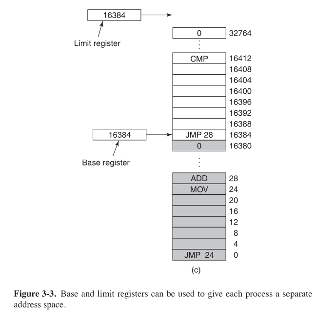
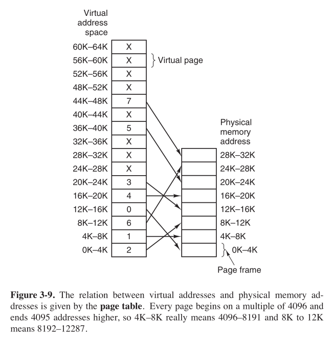

# 《现代操作系统（第四版）》第三章 章节练习题

## 1-10

> ​	1.IBM 360有一個設計，爲了對2KB大小的塊進行加鎖，會對每個塊分配一個4bit的密鑰，這個密鑰存在PSW中，每次內存引用時，CPU都會進行密鑰比較。但該設計有諸多缺點，除了描述中所言，請另外提出至少兩條缺點。

​	IBM 360無存儲器抽象，此設計的目的是爲了在無存儲器抽象的情景下同時運行多個程序。

- 由於密鑰爲4位，所以同時運行的程序最多只能有16個
- 这种设计需要使用特殊的硬件，且速度必須要快

> ​	2.在圖3-3中基址尋址器和界限寄存器含有相同的值16384,這是巧合還是它們總是相等？如果這是巧合，爲什麼在這個例子裏它們是相等的？
>
> 
>
> 

​	是巧合。界限寄存器裝入程序的長度，基址寄存器裝入程序的起始物理地址。在這個例子中，界限寄存器存入的是第一個程序的長度，基址寄存器存入的是第二個程序的起始物理地址。

> ​	3.交換系統通過“緊縮”來消除空閒區。假設有很多空閒區和數據段隨機分布，並且讀或寫32位長的字需要4ns的時間，“緊縮”4GB的空間大概需要多長時間？爲了簡單起見，假設字節0在空閒區中，內存中最高地址處含有有效數據。

讀寫速率：
$$
32b/4ns = 4Byte/4ns = 1Byte/ns = 10^9Byte/s
$$
緊縮空間所做的工作是把進程合並到一塊，將其從一段內存區域移動到另一段，因此其速率應該折半，因此所花時間爲
$$
T = \frac
{4GB}{5 * 10^8Byte/s} \simeq 8.5s
$$
~~哈哈，參考答案又錯了。~~

> ​	4.在一個內存系統中，按內存地址排列的空閒區大小是10MB、4MB、20MB、18MB、7MB、9MB、12MB和15MB。對於連續的段請求：
>
> (a) 12MB
>
> (b) 10MB
>
> (c) 9MB
>
> 使用首次適配算法，將找出哪個空閒區？使用最佳適配，最差適配、下次適配算法呢？

- 首次適配

  20->10->18

- 最佳適配

  12->10->9

- 最差適配

  20->18->15

- 下次適配

  20->18->9

> ​	5.物理地址和虛擬地址有什麼區別？

​	虛擬地址是邏輯上的，由程序產生。物理地址是真實的內存地址。

> ​	6.對下面的每個十進制虛擬地址，分別使用4KB頁面和8KB頁面計算虛擬頁號和偏移量：20000,32768,60000。

​	4KB:(4,3616),(8,0),(14,2656)

​	8KB:(2,3616),(4,0),(7,2656)

> ​	7.使用圖3-9的頁表，給出下面每個虛擬地址對應的物理地址：
>
> (a) 20
>
> (b) 4100
>
> (c) 8300
>
> 

​	
$$
8*1024+(20-0)=8212
$$

$$
4*1024+(4100-4096)
$$

$$
24*1024+(8300-8192)=24684
$$


> ​	8.Intel 8086處理器沒有MMU，也不支持虛擬內存，然而一些公司曾經出售過這種系統：包含未做任何改動的8086 CPU，支持分頁。猜想一下，他們是如何做到這一點的。（提示：考慮MMU的邏輯位置。）

​	在處理器與總線之間加入MMU。

> ​	9.爲了讓分頁虛擬內存工作，需要怎樣的硬件支持？

​	需要MMU。

> ​	10.寫時復制是使用在服務器系統上的好方法，它能否在手機上起作用？

​	能。

## 11-20

> ​	11.考慮下面的C程序：
>
> ```c
> int x[N];
> int step = M;	//M是某個預定義的常量
> for(int i = 0;i < N; i += step) X[i] = x[i] + 1;
> ```
>
> ​	(a)如果這個程序運行在一個頁面大小爲4KB且有64個TLB表項的機器上，那麼M和N取什麼值會使得內層循環的每個執行都引起TLB失效？
>
> ​	(b) 如果循環重復很多遍，結果會和a的答案相同嗎？請解釋。

​	(a)M取4096（最小），N取何值不影響

​	(b)當N取大於等於64K時結果會與a不同，因爲此頁表可存儲64*4 = 256KB的頁面地址，int型變量的大小爲4Byte，則此數組的長度要超過TLB的最大容量才可。

> ​	12.可用於存儲頁面的有效磁盤空間的大小和下列因素有關：最大進程數n， 虛擬地址空間的字節數v， RAM的字節數r。給出最壞情況下磁盤空間需求的表達式。這個數量的真實性如何？

​	nv-r,真實性是沒有多少真實性，因爲v表示的是最大虛擬內存字節數，而並不是所有程序都需要這麼多內存。

> ​	13.如果一條指令執行1ns，缺頁中斷執行額外的Nns，且每k條指令產生一個缺頁，請給出一個公式，計算有效指令時間。

​	每條指令平均執行
$$
1 + \frac{N}{k} ns
$$
​	

> ​	14.一個機器有32位地址空間和8KB頁面，頁表全在硬件中，頁表的每一表項爲一個32位字。進程啓動時，以每個字100ns的速度將頁表從內存復制到硬件中。如果每個進程運行100ms（包含裝入頁表的時間），用來裝入頁表的CPU時間的比例是多少？

​	此機器有
$$
\frac{2^{32}}{2^{13}} = 2^{19} = 524288 
$$
個頁，因此裝入頁表需要
$$
52488 * 100ns \simeq 52.4ms
$$
所以裝入頁表的CPU時間比例爲52.4%。


> ​	15.假設一個機器有48位的虛擬地址和32位的物理地址。
>
> ​	（a）假設頁面大小是4KB，如果只有一級頁表，那麼在頁表裏有多少頁表項？請解釋。
>
> ​	（b）假設同一系統有TLB，該TLB有32個表項。並且假設一個程序的指令正好能放入一個頁，其功能是順序地從數組中讀取長整型元素，該數組存在上千個不同的頁中。在這種情況下TLB的效果如何？

（a)	 2^36

  (b)	在WIndows環境下，一個長整型爲32位，一個4KB頁存儲1024個長整型數，所以每1024次讀取有一次失效。在類Unix環境下，長整型爲64位，所以每512次讀取就有一次失效。

> ​	16.給定一個虛擬內存系統的如下數據：
>
> （a）TLB有1024項，可以在1個時鍾周期（1ns）內訪問。
>
> （b）頁表項可以在100時鍾周期（100ns）內訪問。
>
> （c）平均頁面替換時間是6ms。
>
> 如果TLB處理的頁面訪問佔99%，並且0.01%的頁面訪問會發生缺頁中斷，那麼有效地址轉換時間是多少？

​	頁表訪問佔
$$
1-0.99-0.0001 = 0.0099
$$
​	所以有效地址轉換時間爲
$$
0.99*1+0.0099*100+0.0001*6*10^6= 602 ns
$$
​	即602個時鍾周期。


> ​	17.假設一個機器有38位的虛擬地址和32位的物理地址。
>
> （a）與一級頁表比較，多級頁表的主要優點是什麼？
>
> （b）若採用二級頁表，頁面大小爲16KB，每個頁表項爲4字節，應該對第一級頁表域分配多少位？對第二級頁表域分配多少位？請解釋原因。

​	（a）減少內存中實際頁表數量，佔用內存更少。

​	（b）P1：P2：OFFSET = 12：12：14

> ​	18.在3.3.4節的陳述中，奔騰Pro將多級頁表中的每個頁表項擴展到64位，但仍只能對4GB的內存進行尋址。請解釋頁表項爲64位時，爲何這個陳述正確。

​	P1：P2：P3：OFFSET = 2：9：9：12 

> ​	19.一個32位地址的計算機使用兩級頁表。虛擬地址被分成9位的第一級頁表域、11位的第二級頁表域和一個偏移量，頁面大小是多少？在地址空間中一共有多少個頁面？

​	4KB，2^20個。

> ​	20.一個計算機使用32位的虛擬地址，4KB大小的頁面。程序的數據都位於最低的頁面（0-4095），棧位於最高的頁面。如果使用傳統（一級）分頁，頁表中需要多少個表項？如果使用二級分頁，每部分有10位，需要多少個頁表項？

​	2^20個，3K。

## 21-30

> ​	21.如下是在頁大小爲512字節的計算機上，一個程序片段的執行軌跡。這個程序在1020地址，其棧指針在8192（棧向0生長）。請給出該程序產生的頁面訪問串。每個指令（包括立即常數數）佔4個字節（1個字）。指令和數據的訪問都要在訪問串中計數。
>
> ​	將字6144載入寄存器0
>
> ​	寄存器0壓棧
>
> ​	調用5120處的程序，將返回地址壓棧
>
> ​	棧指針減去立即數16
>
> ​	比較實參和立即數4
>
> ​	如果相等，跳轉到5152處

​	12 15 15 

​	1 2 2 10

> ​	22.一臺計算機的進程在其地址空間有1024個頁面，頁面保存在內存中。從頁表中讀取一個字的開銷是5ns。爲了減小開銷，該計算機使用了TLB，它有32個（虛擬頁面，物理頁框）對，能在1ns內完成查找。請問把平均開銷降到2ns需要的命中率是多少？

​	x * 1 + (1-x)5 = 2 x = 0.75 所以命中率至少为75%。

> ​	23.TLB需要的相連內存設備如何用硬件實現？這種設計對擴展性意味着什麼？

​	

> ​	24.一臺計算機有48位虛擬地址和32位物理地址，頁面大小是8KB，如果採用一級線性頁表，頁表中需要多少個表項？


> ​	25.一個計算機的頁面大小爲8KB，主存大小爲256KB，64GB虛擬地址空間使用倒排頁表實現虛擬內存。爲了保證平均散列鏈的長度小於1,
>
> 散列表應該多大？假設散列表的大小爲2的冪。


> ​	26.一個學生在編譯器設計課程中向教授提議了一個項目：編寫一個編譯器，用來產生頁面訪問列表，該列表可以用於實現最優頁面置換算法。試問這是否可能？爲什麼？有什麼方法可以改進運行時的頁面置換效率？


> ​	27.假設虛擬頁碼索引流中有一些重復的索引序列，該序列之後有時會是一個隨機的頁碼索引。例如，序列0,1,...,511,431,0,1,...,511,223,0,1,...中就包含了0,1,...,511的重復，以及跟隨在它們之後的隨機頁碼索引431和332。
>
> （a）在工作頁負載比該序列短的情況下，標準的頁面置換算法（LRU，FIFO，Clock）在處理頁面時爲什麼效果不好？
>
> （b）如果一個程序分配了500個頁框，請描述一個效果優於LRU、FIFO或Clock算法的頁面置換方法。


> ​	28.如果將FIFO頁面置換算法用到4個頁框和8個頁面上，若初始時頁框爲空，訪問序列串爲0172327103,請問會發生多少次缺頁中斷？如果使用LRU算法呢？


> ​	29.考慮圖3-15 b中的頁面序列。假設從頁面B到頁面A的R位分別是11011011。使用第二次機會算法，被移走的是哪個頁面？


> ​	30.一臺計算機有4個頁框，在第一個時鍾周期R位是0111（頁面0是0,其他頁面是1），在隨後的時鍾周期中這個值是1011、1010、1101、0010、1010、1100、0001。如果使用帶有8位計數器的老化算法，給出最後一個時鍾周期4個計數器的值。


## 31-40

> ​	31.請給出一個頁面訪問序列，使得對於這個訪問序列，使用Clock算法和LRU算法得到的第一個被置換的頁面不同。假設一個進程分配了3個頁框，訪問串中的頁號屬於集合0,1,2,3。


> ​	32.在圖3-20 c的工作集時鍾算法中，表針指向那個R=0的頁面。如果τ=400,這個頁面將被移出嗎？如果τ=1000呢？


> ​	33.假如工作集時鍾頁面置換算法使用的τ爲兩個始終周期，系統狀態如下：
>
> | 頁   | 時間戳 | V    | R    | M    |
> | ---- | ------ | ---- | ---- | ---- |
> | 0    | 6      | 1    | 0    | 1    |
> | 1    | 9      | 1    | 1    | 0    |
> | 2    | 9      | 1    | 1    | 1    |
> | 3    | 7      | 1    | 0    | 0    |
> | 4    | 4      | 0    | 0    | 0    |
>
> 其中，標志位V代表有效位，R代表訪問位，M代表修改位。
>
> （a）如果時鍾中斷發生在時鍾周期10,請給出新的表項內容並給出解釋（可以忽略沒有改變的選項）。
>
> （b）假設沒有時鍾中斷，在時鍾周期10,因爲向頁4發出了一個讀請求而發生了缺頁中斷。請給出新的表項內容並解釋（可以忽略沒有改變的表項）。


> ​	34.一個學生聲稱：“抽象來看，除了選取替代頁面使用的屬性不同外，基本頁面置換算法（FIFO，LRU，最優算法）都相同。”
>
> （a）FIFO、LRU、最優算法使用的屬性是什麼？
>
> （b）請給出這些頁面置換算法的通用算法。